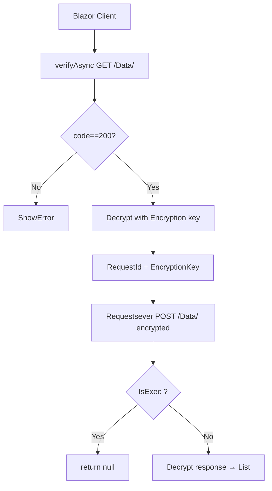

# 🚀 BlazorDeployService – Complete Backend & Service Toolkit for Blazor WASM

Derived from the `BlazorDeployService` NuGet package (v1.0.99, by **Hossein Esfandyari nia** – `blazordeploy.ir`).

## Core Value Proposition

Connect a **Blazor WebAssembly** app **directly to a remote SQL database** — **no backend needed**. Works over an HTTP API (`/api/`) with **encrypted payloads**, **token-based verify**, and full **service layer**:

| Feature | Detail |
|--------|--------|
| Zero-backend SQL | `RequestService` + `SqlService` – SQL over API → `List<T>` / DataTable |
| Multi-language | `LocalizationCacheService` – cache in `localStorage` + auto refresh |
| Dynamic theme | `ThemeService` – 5 Bootstrap themes + dark/light + CSS vars |
| Global modals | `IModalService` – type-safe `Show<TComponent>` with TaskCompletionSource |
| Alerts | `IAlertService` – async success/error/warning/info |
| Secure storage | `IClientStorageService` – AES-encrypted localStorage |
| Culture & RTL | `CultureService` – fa-IR, en-US, ar-SA + direction auto-switch |
| Dev speed | `ISqlService` – attribute-driven schema auto-create (**no SQL needed!**) |

---

## 🧱 Project Structure (as in the NuGet)

```
BlazorDeployService/
├─ Extensions/
│  └─ ServiceCollectionExtensions.cs     # AddBlazorDeployServices(this IServiceCollection)
├─ Services/
│  ├─ RequestService.cs                  # SQL-over-API (verify → encrypt → post → decrypt)
│  ├─ AlertService.cs                   # Async JS-module alerts (toast)
│  ├─ ClientIdService.cs                # Client finger-print/id
│  ├─ ClientStorageService.cs           # localStorage/session/cookies + AES
│  ├─ CultureService.cs                 # RTL/LTR + culture persistence
│  ├─ EncryptionService.cs              # JS-based AES encryption interop
│  ├─ LocalizationCacheService.cs     # Translation cache with DataTables
│  ├─ ModalService.cs                   # Type-safe modals (TaskCompletionSource)
│  ├─ SqlService.cs                     # Attribute-driven CRUD + table auto-create
│  ├─ StorageMonitorService.cs          # watch localStorage changes
│  └─ ThemeService.cs                   # 5 themes + dark mode + CSS vars
├─ Models/
│  ├─ ApiSettings.cs                    # Config (BaseUrl, AppToken, APIKey, keys)
│  ├─ ModalModel.cs                     # Modal state
│  ├─ Request.cs                        # Request DTO
│  ├─ RequestDataTable.cs               # DataTable DTO
│  ├─ DataDto.cs                        # Encrypted request wrapper
│  ├─ ReportDto.cs                      # PDF report DTO
│  ├─ VerifyResult.cs
│  └─ TreeNodeData.cs
├─ Components/
│  ├─ CKEditorBlazor.razor              # CKEditor wrapper (image upload via API)
│  ├─ ThemeSelector.razor               # Theme picker
│  ├─ LanguageSelector.razor           # Language picker
│  └─ Modal.razor                        # Modal host (required in MainLayout)
├─ Helper/
│  └─ AppHelper.cs                      # Connection tokens/constants
└─ wwwroot/js/
    ├─ alertManager.js                   # Alert/toast UI engine
    ├─ interop.js                       # encryption + theme + lang + dir
    └─ ... (persian-date, ckeditor)
```

---

## 🛠 Setup in 4 Steps

### 1. Install
```powershell
Install-Package BlazorDeployService
```

### 2. `Program.cs`
```csharp
using BlazorDeployService.Extensions;
// ...
builder.Services.AddBlazorDeployServices(builder.Configuration);
```

### 3. `appsettings.json`
```json
{
  "BlazorDeploy": {
    "ApiSettings": {
      "BaseUrl": "https://api.blazordeploy.ir/api/",
      "AppToken": "XXXXXXX",
      "ApiKey": null,
      "publickey": "XXXXXX",
      "privatekey": "XXXXXX",
      "Timeout": 30000
    },
    "Encryption": { "Enabled": true, "Key": "XXXX" },
    "Localization": {
      "SupportedLanguageCodes": ["fa-IR", "en-US", "ar-SA"],
      "DefaultLanguage": "fa-IR",
      "EnableAutoDetection": true
    },
    "Deployment": { "MaxRetries": 3, "RetryDelay": 1000 }
  }
}
```

### 4. `MainLayout.razor`
```razor
@inject CultureService cultureService
@inject LocalizationCacheService _cache
@inject ThemeService Theme
@inject IModalService ModalService

<ThemeSelector />
<LanguageSelector />
<Modal />

@code {
    protected override async Task OnInitializedAsync()
    {
        _cache.OnChange += StateHasChanged;
        Theme.OnThemeChanged += OnThemeChanged;
        Theme.OnDarkModeChanged += OnDarkModeChanged;
        cultureService.OnCultureChanged += StateHasChanged;

        await cultureService.InitializeAsync();
        await cultureService.ApplyDirectionAsync();
        await Theme.InitializeAsync();
        await _cache.InitializeAsync();
        await ModalService.InitializeAsync();
    }
}
```

---

## 🔐 Auth & Session Protocol (v2 – NEW)

> The NEW protocol replaces the old verify→encrypt→post flow. Login first, then request with session token.

### Flow
1. **Login**: client sends `projectGuid` + `loginToken` (AES-encrypted with the project's `EncryptionKey`) → `POST {BaseUrl}/api/auth/login` (with `X-Api-Key` header) → server decrypts, compares hash, returns `SessionToken` + `Project` info (name, schema, `SessionTimeoutMinutes`).
2. **Session**: `SessionService` stores token securely; each successful request `Touch`es (renews). **Timeout is in MINUTES (`SessionTimeoutMinutes`), default 10, stored per-project in webapi `Projects` table — adjustable at runtime.** If no request for > timeout → session expires → `SessionExpired` event → UI shows login page again.
3. **Requests**: every call to `/api/request/{query|execute|scalar|script}` must include `X-Auth-Token`. Payload = `{ tsql, model(schema info), parameters, scriptName, correlationId, projectGuid, userId, requireUser }`.
4. **userId**: optional. Only required if payload `requireUser=true` (models/methods we define) → server rejects with 403 if missing. If not required but provided → logged.
5. **Server session**: `SessionStore` (in-memory ConcurrentDictionary) — validates + `Touch` on each request; expired sessions cleaned every 5 min.

### Services (new in package)
| Service | Purpose |
|---------|---------|
| `ISessionService` | Client-side session state + idle timer (10-min default) + `SessionExpired` event |
| `IAuthService` | `LoginAsync(projectGuid, loginToken)` → encrypt → POST → store session |
| `SessionStatus` | enum: `None, LoggingIn, Active, Expired, Rejected` |

### RequestService methods (new)
```csharp
Task<List<T>> QueryAsync<T>(string tsql, object? parameters = null, Guid? userId = null, CancellationToken ct = default);
Task<int> ExecuteAsync(string tsql, object? parameters = null, Guid? userId = null, CancellationToken ct = default);
Task<T?> ScalarAsync<T>(string tsql, object? parameters = null, Guid? userId = null, CancellationToken ct = default);
Task<List<T>> QueryModelAsync<T>(string tsql, T? model = null, Guid? userId = null, CancellationToken ct = default);
Task<int> ExecuteModelAsync<T>(string tsql, T model, Guid? userId = null, CancellationToken ct = default);
Task<List<T>> RunScriptAsync<T>(string scriptName, object? parameters = null, Guid? userId = null, CancellationToken ct = default);
```

### Security headers (client → server)
`X-API-Key` · `X-Timestamp` (anti-replay, 30s window) · `X-Signature` (HMAC-SHA256 over `timestamp|body`) · `X-Project-Guid` · `X-Auth-Token` (session) · optional `X-User-Id`.

> ⚠️ On HTTP 401/403 the client auto-invokes `EndSessionAsync` → login page re-appears.

---



### Key methods
```csharp
public async Task<List<T>?> Request<T>(string sql, object? param = null, bool isExec = false,
    string? connectionstring = null, string userCode = "")
    // public single API for everything
```

1. **`verifyAsync()`** – GET `{BaseUrl}Data/` with `X-API-Key` header → decrypt → `(RequestId, EncryptionKey)`.
2. **`Requestsever<T>()`** – builds `requestdata` (`token`, `requestDate`, `connectionString`, `IsExec`, `SqlStr`, `Parameters`, `ExpairDate`, `token2`) → JSON → AES encrypt → POST `Data/` with `X-API-Key: RequestId` → decrypt response → `List<T>`.
3. **`PrintToPdf(reportPath, dt)`** – POSTs encrypted `ReportDto` to `report/pdf/`, opens returned URL in new tab (`open`).

> ⚠️ Security notes (as designed):
> - Every request gets a **fresh token** (`Guid.NewGuid()`).
> - Payload is **AES encrypted** with per-request `EncryptionKey`.
> - Server responses also encrypted.
> - `ExpairDate` = 24h from now.

---

## 🗄 ISqlService – Attribute-Driven Schema (Zero-SQL CRUD)

This is **the killer feature** of the package. Models self-create their tables!

### Step 1 – Define model with attributes:
```csharp
[Table("Users", TableVersion = 2)]
public class User
{
    [PrimaryKey, Identity] public int Id { get; set; }
    [Required, MaxLength(100)] public string Name { get; set; } = "";
    [SqlType("NVARCHAR(200)")] public string? Email { get; set; }
    [Default("GETDATE()")] public DateTime CreatedAt { get; set; }
}
```

### Step 2 – Auto-create (if missing / outdated):
```csharp
await _sql.InitializeAsync<User>();  // creates table + adds missing columns
```

### Step 3 – Use CRUD:
```csharp
await _sql.Insert<User>(new { Name = "Test", Email = "t@t.com" });
await _sql.Update<User>(new { Name = "Updated" }, new { Id = 1 });
var users = await _sql.Select<User>();
var byId = await _sql.Select<User>(new { Id = 1 });
await _sql.Delete<User>(new { Id = 1 });
```

### Attribute reference (all in `SqlService.cs`):
| Attribute | Purpose |
|----------|---------|
| `[Table("Name", Version=N)]` | Class: table name + schema version |
| `[PrimaryKey]` | Column → `PRIMARY KEY` |
| `[Identity]` | Column → `IDENTITY(1,1)` |
| `[Required]` | Column → `NOT NULL` |
| `[MaxLength(n)]` | `string` → `NVARCHAR(n)` |
| `[SqlType("...")]` | Force custom SQL type |
| `[Default("expr")]` | Column → `DEFAULT expr` |

> The `InitializeAsync<T>` flow: compares a `localStorage` key `Table_{name}` with `TableVersion`; if lower → runs `CREATE TABLE IF NOT EXISTS` + `ALTER TABLE ADD` missing columns.
> ⚠️ SQL is built from **property names** — never interpolates user input (parameters via anonymous objects → ExpandoObject).

---

## 🎨 ThemeService – 5 Bootstrap Themes + Dark/Light

| Theme key | Name | Primary | Secondary |
|-----------|------|---------|-----------|
| `indigo` (default) | Indigo | `#3949ab` | `#5c6bc0` |
| `emerald` | Emerald | `#2e7d32` | `#66bb6a` |
| `blue` | Blue | `#1565c0` | `#42a5f5` |
| `teal` | Teal | `#00796b` | `#26a69a` |
| `rose` | Rose | `#e91e63` | `#f06292` |

- Persists `pref_theme` + `pref_isDark` in localStorage.
- `ToggleDarkAsync()` flips `IsDarkMode` ↔ resolves `data-bs-theme` via `changeTheme('dark'|'light')`.
- `ApplyTheme()`: removes all `theme-*` body classes → applies selected class → sets CSS variables (`--bs-primary`, `--bs-secondary`, `--bs-success`, `--bs-warning`, `--bs-danger`) on `document.documentElement`.
- Events: `OnThemeChanged(string)`, `OnDarkModeChanged(bool)`

```csharp
public async Task ApplyTheme()
{
    await RemoveThemeClasses();
    await _jsModule.InvokeVoidAsync("changeTheme", IsDarkMode ? "dark" : "light");
    await _js.InvokeVoidAsync("eval",
       $"document.body.classList.add('{Themes[CurrentTheme].CssClass}');");
    await ApplyCssVariables();
}
```
> ⚠️ Note: The `theme-*` classes are **noop without CSS rules** — you must add `theme-indigo` etc. rules in your own CSS (or use Bootstrap 5.3 `data-bs-theme` only).

---

## 🌐 CultureService – RTL/LTR Auto-Switch

```csharp
await _cult.SetCulture("en-US"); // → dir=ltr, lang=en
await _cult.SetCulture("fa-IR"); // → dir=rtl, lang=fa
```

- Persists `pref_culture` via `IClientStorageService` (`SetLocalAsync`).
- Sets `CultureInfo.DefaultThreadCurrentCulture/UICulture`.
- `changeLang(lang)` + `changeDir(rtl/ltr)` via interop JS.
- `isRtl()` = `CurrentCulture.TextInfo.IsRightToLeft`.

Map: `fa-IR→fa (RTL)`, `en-US→en (LTR)`, `ar-SA→ar (RTL)`, `ru→ru`, `de→de`, `es→es`, `zh→zh`, `ja→ja`.

---

## 💾 IClientStorageService – Secure Browser Storage

```csharp
await _clientStorage.SetLocalAsync<T>("key", value);      // plain JSON
await _clientStorage.SetLocalEncryptedAsync<T>("key", value, "secret");  // AES
await _clientStorage.GetLocalEncryptedAsync<T>("key", "secret");
await _clientStorage.SetSessionAsync<T>(...);    // sessionStorage
await _clientStorage.SetCookieAsync("key", "value", days);
await _clientStorage.SetSecureCookieAsync(...);   // Base64 + SameSite=Strict + Secure
```

- AES = `Aes.Create()` + `SHA256.HashData(key)` → `IV:encrypted` Base64 format.
- NOTE: AES in JS? The **same `EncryptionService`** is used for the API payload, but the storage encryption is **pure C#** running in the WASM. For true end-to-end security you must also use the **server-side `RequestService`** with `X-API-Key`.

---

## 🪟 IModalService – Type-Safe Modals

```csharp
var result = await ModalService.Show<UserForm>("User Form",
    new Dictionary<string, object> { ["UserName"] = "Test", ["UserEmail"] = "x@y.z" });
```

- Uses a `TaskCompletionSource<object?>` for `await`-able results.
- Injects its own CSS + JS (`blazorModal`) on first use (`InitializeAsync`).
- The actual modal DOM is rendered through a global `<Modal />` component (must be in MainLayout).
- Events: `OnShow(ModalModel)`, `OnClose(modalId)`.
- Supports `Close()`, `CloseAll()`, backdrop click, close button, stackable.

---

## 🔔 AlertService – Async Alerts

```csharp
await AlertService.ShowSuccessAsync("Saved", "Changes are saved");
await AlertService.ShowWarningAsync("Careful", "This will overwrite");
await AlertService.ShowErrorAsync("Error", "Something broke");
await AlertService.ShowInfoAsync("Info", "note");
await AlertService.ShowCustomAsync("danger", "Themed", "msg", 8000);
await AlertService.HideAllAsync();
```

- Lazy-imports `alertManager.js` as ES module on first use (`import`).
- UI in JS: `showAlert(type, title, message, duration)`.

---

## 🧮 LocalizationCacheService (Multi-Lang DB-driven)

- Caches two DataTables from DB (`LangCache`, `LanguageTranslationCache`) into `localStorage` with **1-day expiry**.
- Auto-detects language from `pref_culture`; falls back to configured default.
- `GetValue(key)` → looks up translation by `Name`; if missing → **auto-inserts** the key (so new keys appear for translators) then returns the key.
- `RefreshCache()` → clears caches → reload from DB → `OnChange` event.

---

## 🗃 JS Module Files (in package `_content/BlazorDeployService/`)

| File | Functions |
|------|-----------|
| `js/alertManager.js` | `initialize()`, `showAlert(type,title,msg,duration)`, `hideAllAlerts()` |
| `js/interop.js` | `encryptData(data,key)`, `decryptData(data,key)`, `generateRandomKey()`, `changeTheme(mode)`, `changeLang(lang)`, `changeDir(dir)` |

> Both are imported as **ES modules** via `IJSRuntime` `import('...')`.

---

## 📦 Publishing Your Own NuGet (like this one)

```powershell
dotnet pack -c Release -p:PackageId=BlazorDeployService -p:PackageVersion=1.0.99 -o .\artifacts
```

And push:
```powershell
dotnet nuget push .\artifacts\*.nupkg -k <API_KEY> -s https://api.nuget.org/v3/index.json
```

The `.nupkg` here multi-targets: `net8.0, net9.0, net10.0, net8.0-browser, net9.0-browser, net10.0-browser` and packs `wwwroot/**` into `_content/BlazorDeployService/`.

---

## 🧠 When to Use

- Any Blazor WASM app that must talk to SQL **without a custom backend**.
- Any app requiring **multi-language, theming, alerts, modals, storage** in one dependency.
- When you want **attribute-driven table auto-creation** to prototype fast.
- When your team prefers **no MudBlazor/Radzen** (all components are Bootstrap + JS).

---

## 🔗 Related

- `blazor-clean-architecture` – server-side Clean Architecture with Dapper
- `blazor-wasm-bootstrap` – pure-Bootstrap components & shared CSS
- `blazor-translate-theme-service` – TranslateService/ThemeService (localStorage + events)